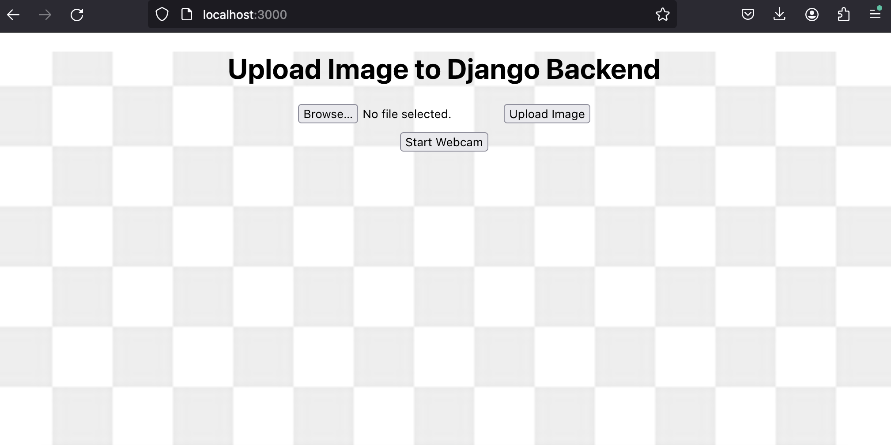

# Resnet Webapp

Resnet_webapp is a project designed to obtain predictions of an image from the Resnet model. It showcases how to integrate a powerful machine learning model with a web application using Django and React.

## Getting Started

These instructions will get you a copy of the project up and running on your local machine for development and testing purposes.

### Prerequisites

- Docker
- Docker Compose

### Installation and Running

Follow these steps to get your development environment running:

1. **Start Docker on your machine.**

2. **Clone the repository (if you haven't already):**

```bash
git clone https://github.com/RaviKushawaha/Resnet_webapp.git
cd resnet_webapp
docker-compose up
```

The application should now be running and accessible at http://localhost:3000.

### Home Screen Preview
Here's what the home screen looks like:



### Usage
1. Open your web browser and navigate to http://localhost:3000.
2. Upload an image using the web interface to get a prediction from the Resnet model.
3. User can start webcam and capture a picture, then upload it for AI prdiction.

### Cleanup
After you're done, remember to stop and remove the containers to free up resources:
```bash
docker-compose down
```

### Project Overview
This project is built using Django for the backend, providing RESTful services, and React for the front-end, creating an interactive user interface. It utilizes the Resnet model for image classification, offering users insights into the content of their images.